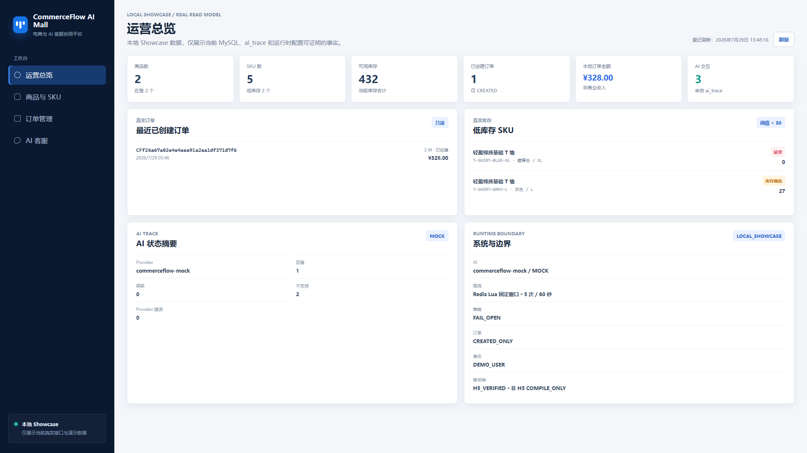
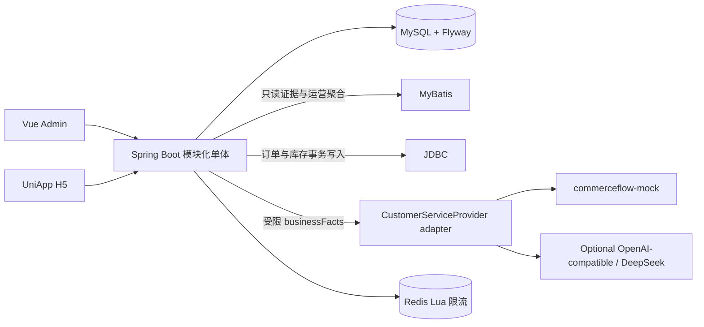
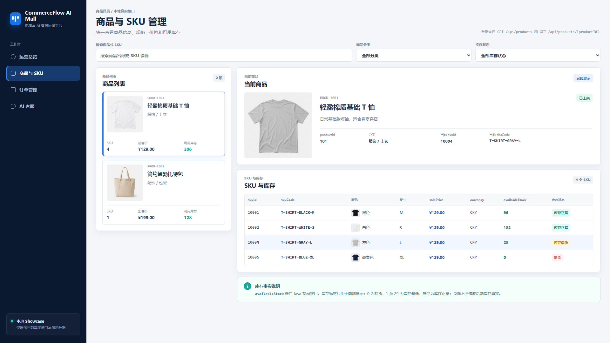
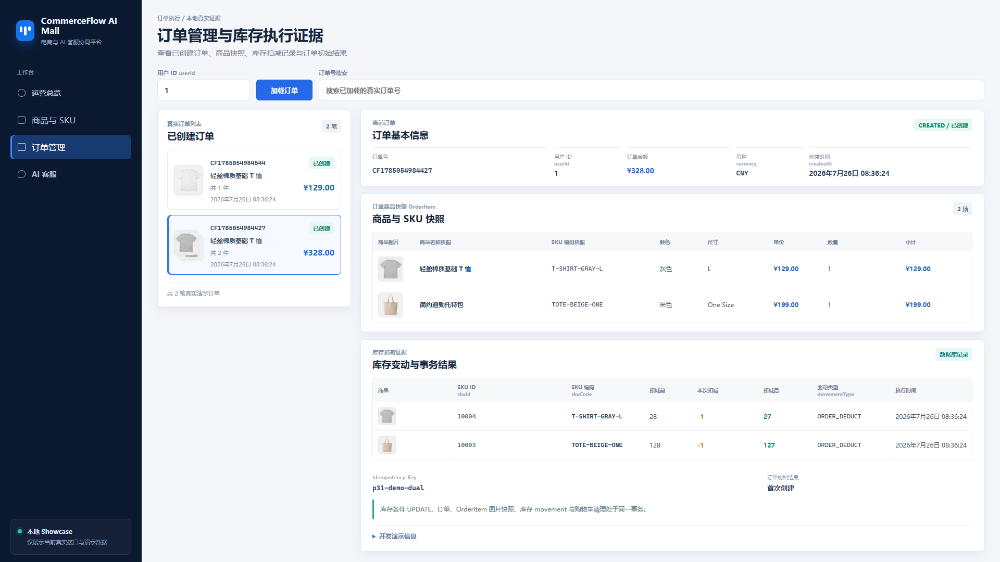
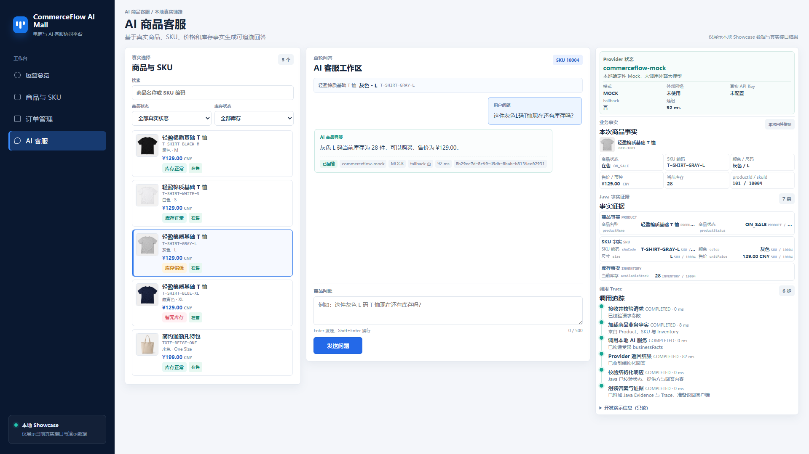
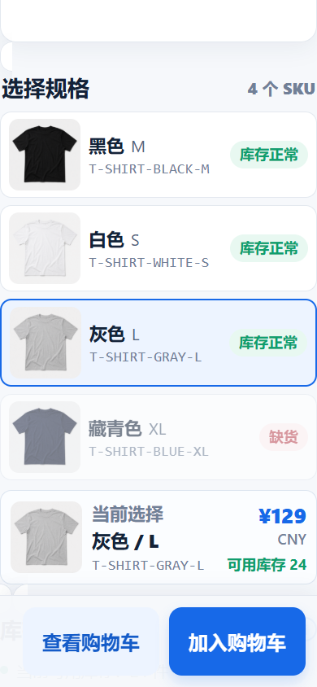
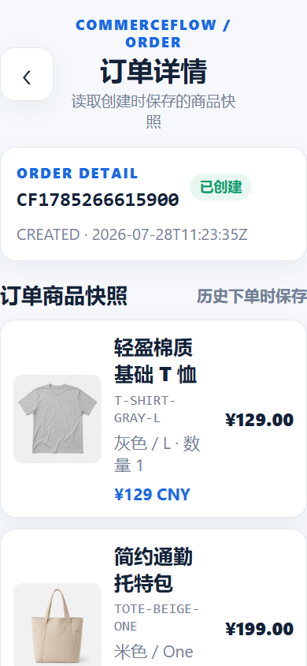
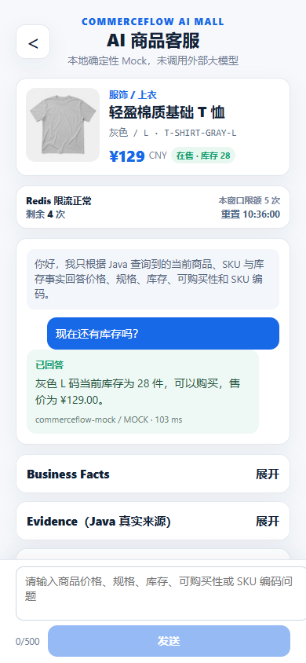

# CommerceFlow AI Mall

> 2026-09-05 第一阶段部署审计：当前总状态 **BLOCKED**。最新 Java 91/91（无跳过）、Python 11/11、Admin 46/46、H5 36/36、应用生产构建、配置守卫、空库 schema-only 初始化及 Compose 静态检查为 **LOCAL_PASS**。共享 OIDC 源码、Demo 迁移种子、容器化 RDS/Tair 接线、Admin/H5 client 隔离和跨项目 smoke 来源问题已完成本地整改；Docker registry、云资源、真实 Secret/OIDC、DNS/ICP/TLS 及公网验收仍 **STAGING_PENDING** 或 **BLOCKED**。详见 [本项目审计与部署计划](docs/release/STAGING_AUDIT_PLAN_20260905.md)。Compose 语法通过不代表可直接部署。

**电商与 AI 客服协同平台**，用于展示 Java 后端、AI 应用、Vue 管理端与 UniApp H5 的一条可本地重建的 Showcase 链路。

> `LOCAL SHOWCASE` · `commerceflow-mock` 确定性 Mock · `CNY_ONLY` · `H5_VERIFIED` · 非 H5 仅编译通过

这是本地求职展示项目，不是生产系统。Codex 对 Showcase 实现有实质贡献；代码所有权差距与后续学习重构计划如实记录在 [OWNERSHIP_GAPS](docs/career/OWNERSHIP_GAPS.md)。



**核心技术**：Java 17 · Spring Boot 3 模块化单体 · MySQL 8.4 · Flyway · JDBC 事务写路径 · MyBatis 只读聚合 · Vue 3 + TypeScript · UniApp · Python 3.12 + FastAPI · Redis 8.0.2 Lua 限流。

## 解决的问题

- 用真实 Product、SKU、Inventory 数据完成商品浏览、购物车与 `CREATED` 订单创建。
- 用 MySQL 唯一约束和 `Idempotency-Key` 处理重复提交；库存扣减、订单快照与库存变动证据在同一事务中完成。
- 由 Java 从 MySQL 构造 `businessFacts`，再调用 FastAPI 的确定性 `commerceflow-mock`，返回可核对的回答、Evidence 与 Trace。
- 用 Redis Lua 固定窗口保护 AI 接口，并在页面展示真实 429 / Retry-After 边界。

## 真实能力与边界

| 已实现且有本地证据 | 明确未实现或不应声称 |
| --- | --- |
| 商品、SKU、库存、购物车、订单快照、库存变动、幂等 | 支付、物流、退款、地址、优惠券 |
| Java 事实驱动 AI 客服、Java fallback、Evidence、Trace；价格与订单只支持 CNY；GPT/DeepSeek 兼容 Provider 适配边界和本地协议测试 | 真实外部模型调用、真实 API Key 验收、真实客户数据 |
| Redis 5 次 / 60 秒 Lua 限流、429、FAIL_OPEN Showcase 边界 | 生产认证、DDoS 防护、高并发或商业运营结论 |
| Admin 真实本地 API 页面；UniApp H5 浏览器验收 | 原生设备、微信小程序、Android 或 iOS 运行时验收 |

当前默认仍是本地 Demo，不会伪装成真实注册登录；但 OIDC/JWT Resource Server、消费者身份映射、Operator 角色边界以及 Admin/H5 的 Authorization Code + PKCE 适配已经实现，staging profile 会关闭 Demo 身份和 legacy 路由。仓库根目录的 `.env.example` 仍显式开启本地 Demo 用户和 Demo Operator，基础 Spring 配置本身不创建任何默认身份；`/api/v1/me/...` 由 `CurrentUserPort` 派生消费者范围，`/api/v1/operator/...` 由独立 `OperatorScope` 授权跨用户管理读取。旧 `/api` 兼容链路仅在显式 LOCAL/DEMO 模式开启，不能作为公网权限边界。订单状态只有 `CREATED`。Redis 身份摘要不是生产认证，`FAIL_OPEN` 只适用于当前 Mock Showcase。真实 IdP、真实模型账号和公网服务器尚未在本工作区完成连接，执行边界见 [真实认证、Provider 与部署说明](docs/REAL_AUTH_PROVIDER_DEPLOYMENT.md)。

金额合同固定为 CNY：商品 SKU、购物车、订单和订单明细都使用 `CNY`。Java 订单服务拒绝非 CNY SKU，Flyway V9 又在 `product_sku`、`orders` 和 `order_item` 上补齐数据库约束；这不是对多币种结算能力的宣称。

## 系统架构



完整图与字段关系见 [架构文档](docs/architecture/README.md)。

后端演进按 E0～E4 推进，并补充 Phase 0-B 接口边界收口：E0 展示版契约冻结、消费者/Operator 身份边界、E1 Showcase 用户作用域、E2 订单端口/事务 Outbox 写入基础、E3 Provider/低基数指标基础和 E4 staging 部署资产。E4 目前只代表可审查、可配置的部署骨架和环境校验，不代表真实身份、备份恢复、公网 DNS/证书、真实供应商运行或已经上线；这些边界仍按 [后端下一阶段设计](docs/design/BACKEND_NEXT_PHASE_DESIGN.md) 独立验收。

E4 的部署资产已经放在 [staging 设计与运行说明](docs/design/BACKEND_E4_STAGING.md)：默认只绑定本机 edge 端口，MySQL/Redis/FastAPI/API 均在私有 Docker 网络中；启动前校验会拒绝占位密码或 Demo 身份。未完成真实 IdP、DNS、证书、备份恢复和公网发布前，不要直接开放链接。

## 关键页面

### Admin 真实页面

| 运营总览 | 商品与 SKU | 订单与库存证据 | AI 商品客服 |
| --- | --- | --- | --- |
|  |  |  |  |
| 本地 MySQL / `ai_trace` 聚合 | 真实产品、SKU 与库存 | 订单快照、变动证据与幂等结果 | Java 事实、Evidence 与 Trace |

### UniApp H5 原始截图

以下三图是原始 `390×844` H5 运行截图，并非拼图或设备验收。

| 商品详情 | 订单详情 | AI 商品客服 |
| --- | --- | --- |
|  |  |  |

Redis 429 与 FAIL_OPEN 是技术证据，见 [Canonical 截图索引](docs/showcase/CANONICAL_SCREENSHOTS.md)，不占用 README 主视觉。

### 前端重做与真实浏览器验收

2026-09-03 的前端重做已将 H5 调整为商品图优先的轻量 storefront，将 Admin 调整为证据优先的运营工作台；真实截图、页面状态、viewport、控制台检查和限制项集中记录在 [前端重做验收记录](docs/evidence/frontend-redesign/README.md)。只读审查和逐页规格见 [前端现状审查](docs/design/FRONTEND_CURRENT_AUDIT.md) 与 [前端页面规格](docs/design/FRONTEND_PAGE_SPECS.md)。

本轮真实浏览器截图入口：

| Admin 1366×768 | H5 390×844 |
| --- | --- |
| [Overview](docs/evidence/frontend-redesign/screenshots/admin-overview-1366.png) · [Product/SKU](docs/evidence/frontend-redesign/screenshots/admin-product-sku-1366.png) · [Order Evidence](docs/evidence/frontend-redesign/screenshots/admin-order-evidence-1366.png) · [AI Workbench](docs/evidence/frontend-redesign/screenshots/admin-ai-workbench-1366.png) | [Product List](docs/evidence/frontend-redesign/screenshots/mobile-product-list-390.png) · [Product Detail](docs/evidence/frontend-redesign/screenshots/mobile-product-detail-390.png) · [Cart](docs/evidence/frontend-redesign/screenshots/mobile-cart-390.png) · [Order Confirm](docs/evidence/frontend-redesign/screenshots/mobile-order-confirm-390.png) · [Order Result](docs/evidence/frontend-redesign/screenshots/mobile-order-result-390.png) · [Order Detail](docs/evidence/frontend-redesign/screenshots/mobile-order-detail-390.png) · [AI](docs/evidence/frontend-redesign/screenshots/mobile-ai-390.png) |

## 核心链路

### 商品、订单与库存

`Product -> SKU -> Inventory` 是当前商品事实。提交订单时服务端接收 `Idempotency-Key`，聚合同一 SKU，按 SKU ID 稳定排序完成锁定与扣减，执行带库存条件的原子 `UPDATE`，写入 `orders`、`order_item` 快照和 `inventory_movement`，并在一个 MySQL 事务中提交。重复的同 Key 同请求返回原订单；同 Key 不同请求返回 `409`。详见 [订单事务链路](docs/architecture/ORDER_TRANSACTION_FLOW.md)。

### AI 商品客服

消费者前端只发送 `productId`、`skuId`、`question`、`clientRequestId`，不发送 `userId`；管理端 AI 使用独立 Operator 路径，也不接受消费者 `userId`。Java 从 MySQL 加载业务事实、构造 Evidence，通过 `CustomerServiceProvider` 选择 FastAPI 或 OpenAI-compatible 适配器，再校验结构化回答并保存最小化 Trace 摘要。Provider 不写业务数据库、不回调 Java、不编造库存；不可用时 Java 使用事实约束 fallback。详见 [AI 事实链路](docs/architecture/AI_GROUNDED_ANSWER_FLOW.md)、[Phase 0-B 边界设计](docs/design/PHASE_0B_API_BOUNDARY_AUTHORIZATION.md) 和 [E3 Provider 设计](docs/design/BACKEND_E3_PROVIDER_OBSERVABILITY.md)。

### Redis 限流

消费者 `POST /api/v1/me/ai/customer-service/ask` 与管理端 `POST /api/v1/operator/ai/customer-service/ask` 受 Redis Lua 固定窗口保护，默认 5 次 / 60 秒。第 6 次返回 429 与 `Retry-After`；429 不调用 Provider、不写 AI Trace。Redis 不参与订单、库存、购物车或 MySQL 事务。详见 [Redis 限流链路](docs/architecture/REDIS_RATE_LIMIT_FLOW.md)。

## 快速启动

前提：Java 17、Node 20、Python 3.12、Docker Desktop。复制模板后使用受控脚本启动：

```powershell
Copy-Item .env.example .env
powershell -NoProfile -File .\scripts\showcase\start.ps1 -IncludeMobile
```

常用命令：

```powershell
powershell -NoProfile -File .\scripts\showcase\status.ps1
powershell -NoProfile -File .\scripts\showcase\verify.ps1 -IncludeMobile
powershell -NoProfile -File .\scripts\showcase\verify.ps1 -IncludeMobile -IncludeOrderSmoke -IncludeRateLimitSmoke
powershell -NoProfile -File .\scripts\showcase\stop.ps1
```

默认 Java 端口是 `8080`。若端口冲突，可在当前 PowerShell 会话中覆盖，例如 `$env:MALL_API_PORT = "8081"`，再运行启动脚本。脚本不会结束未知进程；默认停止不删除 Docker 数据，`-RemoveData` 需要明确确认。不要使用 `ExecutionPolicy Bypass`。

手动启动与排错见 [README_FIRST_RUN](README_FIRST_RUN.md) 和 [TROUBLESHOOTING](TROUBLESHOOTING.md)。

## 测试与 CI

GitHub Actions 设有五个清晰职责：`repository-integrity`、`java-backend`、`python-ai-service`、`admin-web`、`mobile-app`。Java job 使用真实 MySQL 8.4 与 Redis 8.0.2，并进行 Flyway V1–V10 概览 smoke；Python 固定 Mock Provider；Provider 兼容协议使用本地 fixture 测试，不调用外部模型；前端不依赖已运行的 Java 服务。

当前本地验收矩阵与精确数量见 [当前验收矩阵](docs/evidence/ACCEPTANCE_MATRIX.md)、[前端重做验收记录](docs/evidence/frontend-redesign/README.md) 和 [P7C 测试结果](docs/evidence/P7-showcase/P7C_TEST_RESULTS.md)。CI 不调用外部 AI、不读取真实密钥、不部署、不发布镜像。

## 演示顺序

1. 打开 Admin 运营总览，说明这些数值来自本地 MySQL、`ai_trace` 与运行时配置。
2. 进入商品与 SKU，说明 Product、SKU、Inventory 的关系和只读边界。
3. 查看订单证据，讲解原子扣库存、快照、幂等与事务回滚。
4. 在 AI 客服中展示 Java 业务事实、Mock 回答、Evidence、Trace 与 fallback 边界。
5. 在 UniApp H5 展示商品、购物车、订单和 AI 客服；说明非 H5 仅完成编译。

## 目录

```text
apps/mall-api/       Java API、事务与 MyBatis 只读模型
apps/admin-web/      Vue 管理端
apps/mobile-app/     UniApp H5 与非 H5 编译目标
services/ai-service/ FastAPI 与 commerceflow-mock
scripts/showcase/    安全的本地生命周期脚本
docs/architecture/   系统、请求链路与数据模型
docs/evidence/       阶段验收与冻结证据
docs/design/         设计审查、页面规格与事实边界
screenshots/v2/      真实运行截图
```

## 来源、许可与面试材料

- [第三方声明](THIRD_PARTY_NOTICES.md) 与 [来源记录](docs/reference/SOURCE_PROVENANCE.md)
- [截图分类与用途](docs/showcase/CANONICAL_SCREENSHOTS.md)
- [项目三分钟介绍](docs/career/PROJECT_3_MINUTE_INTRO.md)、[十分钟 walkthrough](docs/career/PROJECT_10_MINUTE_WALKTHROUGH.md)、[面试问题](docs/career/INTERVIEW_QUESTIONS.md)
- [P2–P7 证据入口](docs/evidence/) 与 [P7 发布规划](docs/release/P7_RELEASE_AUDIT_SUMMARY.md)
