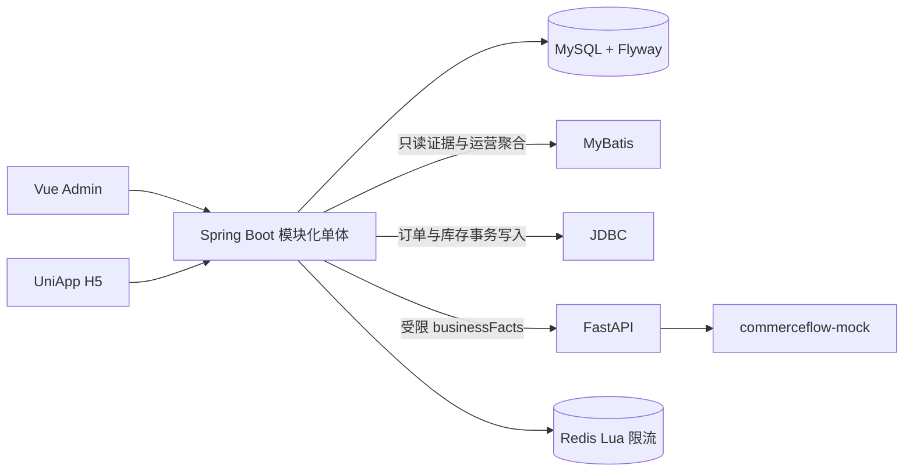

# CommerceFlow AI Mall

**电商与 AI 客服协同平台**，用于展示 Java 后端、AI 应用、Vue 管理端与 UniApp H5 的一条可本地重建的 Showcase 链路。

> `LOCAL SHOWCASE` · `commerceflow-mock` 确定性 Mock · `H5_VERIFIED` · 非 H5 仅编译通过

这是本地求职展示项目，不是生产系统。Codex 对 Showcase 实现有实质贡献；代码所有权差距与后续学习重构计划如实记录在 [OWNERSHIP_GAPS](docs/career/OWNERSHIP_GAPS.md)。


**核心技术**：Java 17 · Spring Boot 3 模块化单体 · MySQL 8.4 · Flyway · JDBC 事务写路径 · MyBatis 只读聚合 · Vue 3 + TypeScript · UniApp · Python 3.12 + FastAPI · Redis 8.0.2 Lua 限流。

## 解决的问题

- 用真实 Product、SKU、Inventory 数据完成商品浏览、购物车与 `CREATED` 订单创建。
- 用 MySQL 唯一约束和 `Idempotency-Key` 处理重复提交；库存扣减、订单快照与库存变动证据在同一事务中完成。
- 由 Java 从 MySQL 构造 `businessFacts`，再调用 FastAPI 的确定性 `commerceflow-mock`，返回可核对的回答、Evidence 与 Trace。
- 用 Redis Lua 固定窗口保护 AI 接口，并在页面展示真实 429 / Retry-After 边界。

## 真实能力与边界

| 已实现且有本地证据 | 明确未实现或不应声称 |
| --- | --- |
| 商品、SKU、库存、购物车、订单快照、库存变动、幂等 | 支付、物流、退款、地址、优惠券 |
| Java 事实驱动 AI 客服、Java fallback、Evidence、Trace | 外部大模型调用、真实 API Key、真实客户数据 |
| Redis 5 次 / 60 秒 Lua 限流、429、FAIL_OPEN Showcase 边界 | 生产认证、DDoS 防护、高并发或商业运营结论 |
| Admin 真实本地 API 页面；UniApp H5 浏览器验收 | 原生设备、微信小程序、Android 或 iOS 运行时验收 |

当前无真实注册登录；`userId=1` 是演示用户。订单状态只有 `CREATED`。Redis 身份摘要不是生产认证，`FAIL_OPEN` 只适用于当前 Mock Showcase。

## 系统架构



完整图与字段关系见 [架构文档](docs/architecture/README.md)。

## 关键页面

### Admin 真实页面

| 运营总览 | 商品与 SKU | 订单与库存证据 | AI 商品客服 |
| --- | --- | --- | --- |
|  |  |  |  |
| 本地 MySQL / `ai_trace` 聚合 | 真实产品、SKU 与库存 | 订单快照、变动证据与幂等结果 | Java 事实、Evidence 与 Trace |

### UniApp H5 原始截图

以下三图是原始 `390×844` H5 运行截图，并非拼图或设备验收。

| 商品详情 | 订单详情 | AI 商品客服 |
| --- | --- | --- |
|  |  |  |

Redis 429 与 FAIL_OPEN 是技术证据，见 [Canonical 截图索引](docs/showcase/CANONICAL_SCREENSHOTS.md)，不占用 README 主视觉。

## 核心链路

### 商品、订单与库存

`Product -> SKU -> Inventory` 是当前商品事实。提交订单时服务端接收 `Idempotency-Key`，聚合同一 SKU，执行带库存条件的原子 `UPDATE`，写入 `orders`、`order_item` 快照和 `inventory_movement`，并在一个 MySQL 事务中提交。重复的同 Key 同请求返回原订单；同 Key 不同请求返回 `409`。详见 [订单事务链路](docs/architecture/ORDER_TRANSACTION_FLOW.md)。

> **订单可靠性证据：** 使用真实 MySQL 8.4 覆盖库存竞争、并发幂等、Key 冲突、事务回滚与重复 SKU 聚合；本地独立数据库连续三次通过。详见 [Order Reliability Evidence V1](docs/evidence/order-reliability-v1/README.md)。这不是生产负载或吞吐量声明。
### AI 商品客服

前端仅发送 `userId`、`productId`、`skuId`、`question`、`clientRequestId`。Java 从 MySQL 加载业务事实、构造 Evidence、调用 FastAPI，再校验结构化回答并保存最小化 Trace 摘要。Python 不写业务数据库、不回调 Java、不编造库存；不可用时 Java 使用事实约束 fallback。详见 [AI 事实链路](docs/architecture/AI_GROUNDED_ANSWER_FLOW.md)。

### Redis 限流

仅 `POST /api/ai/customer-service/ask` 受 Redis Lua 固定窗口保护，默认 5 次 / 60 秒。第 6 次返回 429 与 `Retry-After`；429 不调用 Provider、不写 AI Trace。Redis 不参与订单、库存、购物车或 MySQL 事务。详见 [Redis 限流链路](docs/architecture/REDIS_RATE_LIMIT_FLOW.md)。

## 快速启动

前提：Java 17、Node 20、Python 3.12、Docker Desktop。复制模板后使用受控脚本启动：

```powershell
Copy-Item .env.example .env
powershell -NoProfile -File .\scripts\showcase\start.ps1 -IncludeMobile
```

常用命令：

```powershell
powershell -NoProfile -File .\scripts\showcase\status.ps1
powershell -NoProfile -File .\scripts\showcase\verify.ps1 -IncludeMobile
powershell -NoProfile -File .\scripts\showcase\stop.ps1
```

默认 Java 端口是 `8080`。若端口冲突，可在当前 PowerShell 会话中覆盖，例如 `$env:MALL_API_PORT = "8081"`，再运行启动脚本。脚本不会结束未知进程；默认停止不删除 Docker 数据，`-RemoveData` 需要明确确认。不要使用 `ExecutionPolicy Bypass`。

手动启动与排错见 [README_FIRST_RUN](README_FIRST_RUN.md) 和 [TROUBLESHOOTING](TROUBLESHOOTING.md)。

## 测试与 CI

GitHub Actions 设有五个清晰职责：`repository-integrity`、`java-backend`、`python-ai-service`、`admin-web`、`mobile-app`。Java job 使用真实 MySQL 8.4 与 Redis 8.0.2，并进行 Flyway V1–V8 概览 smoke；Python 固定 Mock Provider；前端不依赖已运行的 Java 服务。

当前本地验收摘要与精确数量见 [P7C 测试结果](docs/evidence/P7-showcase/P7C_TEST_RESULTS.md)。CI 不调用外部 AI、不读取真实密钥、不部署、不发布镜像。

## 演示顺序

1. 打开 Admin 运营总览，说明这些数值来自本地 MySQL、`ai_trace` 与运行时配置。
2. 进入商品与 SKU，说明 Product、SKU、Inventory 的关系和只读边界。
3. 查看订单证据，讲解原子扣库存、快照、幂等与事务回滚。
4. 在 AI 客服中展示 Java 业务事实、Mock 回答、Evidence、Trace 与 fallback 边界。
5. 在 UniApp H5 展示商品、购物车、订单和 AI 客服；说明非 H5 仅完成编译。

## 目录

```text
apps/mall-api/       Java API、事务与 MyBatis 只读模型
apps/admin-web/      Vue 管理端
apps/mobile-app/     UniApp H5 与非 H5 编译目标
services/ai-service/ FastAPI 与 commerceflow-mock
scripts/showcase/    安全的本地生命周期脚本
docs/architecture/   系统、请求链路与数据模型
docs/evidence/       阶段验收与冻结证据
screenshots/v2/      真实运行截图
```

## 来源、许可与面试材料

- [第三方声明](THIRD_PARTY_NOTICES.md) 与 [来源记录](docs/reference/SOURCE_PROVENANCE.md)
- [截图分类与用途](docs/showcase/CANONICAL_SCREENSHOTS.md)
- [项目三分钟介绍](docs/career/PROJECT_3_MINUTE_INTRO.md)、[十分钟 walkthrough](docs/career/PROJECT_10_MINUTE_WALKTHROUGH.md)、[面试问题](docs/career/INTERVIEW_QUESTIONS.md)
- [P2–P7 证据入口](docs/evidence/) 与 [P7 发布规划](docs/release/P7_RELEASE_AUDIT_SUMMARY.md)
