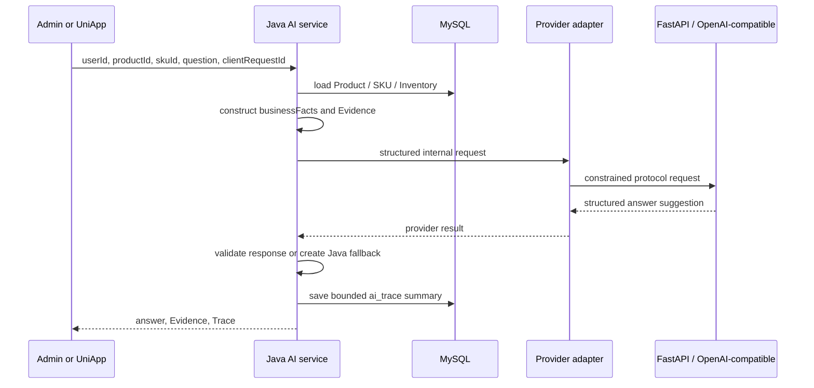

# AI Grounded Answer Flow

1. The client sends only `userId`, `productId`, `skuId`, `question`, and `clientRequestId`.
2. Java reads product facts from MySQL and creates authoritative `businessFacts` plus seven Evidence items.
3. Java calls the selected Provider adapter. In the default Showcase it reaches FastAPI and `commerceflow-mock`; external mode uses the server-side OpenAI-compatible adapter.
4. `commerceflow-mock` is deterministic and relies on supplied facts. No external model is invoked in the local Showcase unless the external mode is explicitly configured with a runtime secret.
5. Java validates trace id, provider metadata, status and bounded answer content. It persists a privacy-minimized category summary, not the raw provider payload, API key, prompt or stack trace.
6. If Python is unavailable, times out, or returns invalid data, Java returns a fact-bound `java-fact-fallback`. Unsupported questions remain unsupported rather than invented.

There is no Java -> Python -> Java network loop. Neither FastAPI nor an external Provider becomes a business fact source; Java remains the owner of Product, Inventory, Evidence and Trace.
