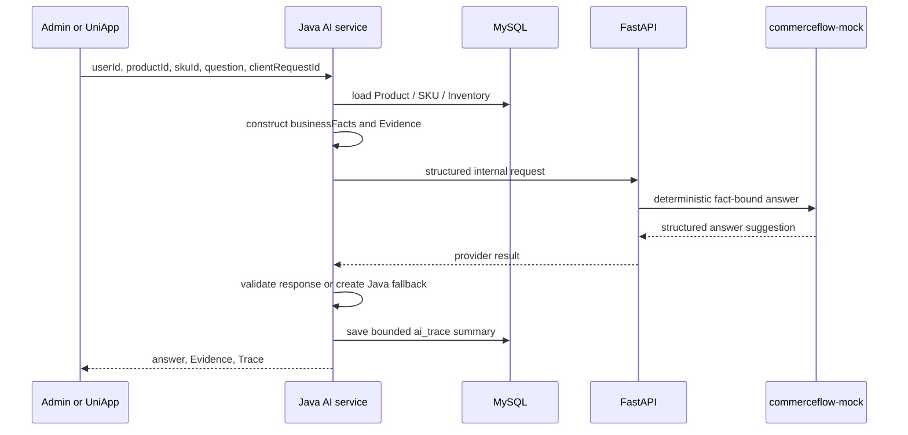

# AI Grounded Answer Flow

1. The client sends only `userId`, `productId`, `skuId`, `question`, and `clientRequestId`.
2. Java reads product facts from MySQL and creates authoritative `businessFacts` plus seven Evidence items.
3. Java calls FastAPI; Python receives no direct database credential or unrelated personal information.
4. `commerceflow-mock` is deterministic and relies on supplied facts. No external model is invoked in the local Showcase.
5. Java validates trace id, provider metadata, status and bounded answer content. It persists a privacy-minimized category summary, not the raw provider payload, API key, prompt or stack trace.
6. If Python is unavailable, times out, or returns invalid data, Java returns a fact-bound `java-fact-fallback`. Unsupported questions remain unsupported rather than invented.

There is no Java -> Python -> Java network loop. Python never writes Product, Inventory, Cart or Order data and does not become a business fact source.
## AI1 configuration and remote-adapter boundary

- Mock remains the default when no project, shared, or legacy provider configuration is valid.
- Project-scoped `COMMERCEFLOW_AI_*` configuration has priority, followed by shared `PORTFOLIO_AI_*`, then legacy compatibility variables. No values are documented or persisted.
- The OpenAI-compatible Chat Completions adapter is used only for a synthetic smoke request. Python validates strict structured JSON and exact claims against Java-supplied business facts.
- Java remains the Product, SKU, Inventory, Evidence, Trace, and fallback owner. A remote failure returns a typed, sanitized failure to Java; Java decides whether its fact-bound fallback is enabled.
- This is not a production-stability, provider-availability, or capacity claim.

## AI1.1 failure observability

Java records only a safe failure code from the AI boundary. Codes distinguish Java-to-FastAPI transport, remote-provider transport or HTTP classes, response validation, and configuration rejection. FastAPI returns a fixed safe message for each code and never forwards exception text or upstream body. Fallback remains Java-owned. The initial real smoke failure is retained as historical evidence because it lacked sufficient layer evidence; AI1.1 added local stub diagnostics and performed no new real request.

## AI1.2 real-smoke readiness

The remote adapter sends one bounded Chat Completions request containing only `model` and `messages`. Its strict response contains intent, answer status, and a complete claim echo, never a free-text answer. Python checks the claims and a limited Chinese/English intent classifier, then renders Chinese text from Java-owned facts. Provider configuration is resolved per field across project, shared portfolio, and legacy layers; a partial project override cannot mask a complete shared configuration. The initial failure remains recorded as historical evidence, while the separately authorized AI1.3 synthetic smoke completed with `AI_PRODUCT_ASSISTANT_REAL_SMOKE_PASS`. This is a bounded integration result, not a production availability or capacity claim.

## AI1.3 final synthetic smoke

One authorized synthetic request completed through Java, FastAPI, and the compatible-provider adapter. The strict schema, intent, complete claims, Java-owned Evidence and Trace, and grounded renderer checks passed; `fallbackUsed=false`. The request was performed once and was not retried. This result does not claim production stability, availability, capacity, or unrestricted provider access.

## AI1.4 URL safety boundary

The remote adapter accepts HTTPS provider base URLs. Plain HTTP is fail-closed unless the host is the local test host `localhost`, `127.0.0.1`, or `::1`. Userinfo, query strings, and fragments are rejected. Accepted paths are normalized to exactly `/v1/chat/completions`, including base, `/v1`, `/chat/completions`, and `/v1/chat/completions` forms. Configuration errors use a fixed safe code and never include the URL.
