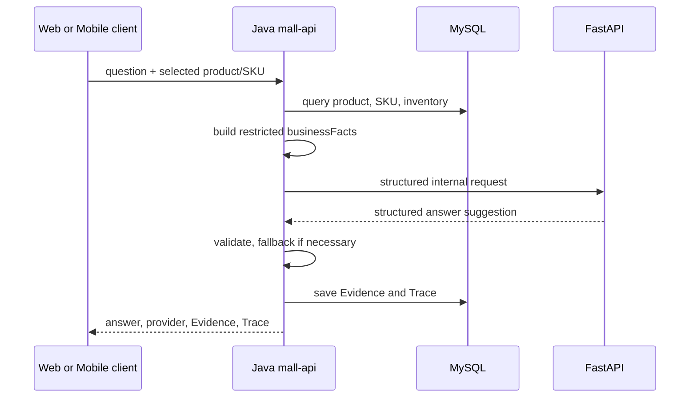

# AI Grounded Answer Flow

Java is the business-fact source. `businessFacts` includes the selected product/SKU, available stock, price as a string, currency, question, snippets, and query time; it excludes unrelated personal data. FastAPI cannot write the business database, invent inventory, or callback Java. Normal Showcase mode uses deterministic `commerceflow-mock`; Java fact fallback is an explicit result, not a fabricated provider answer.
