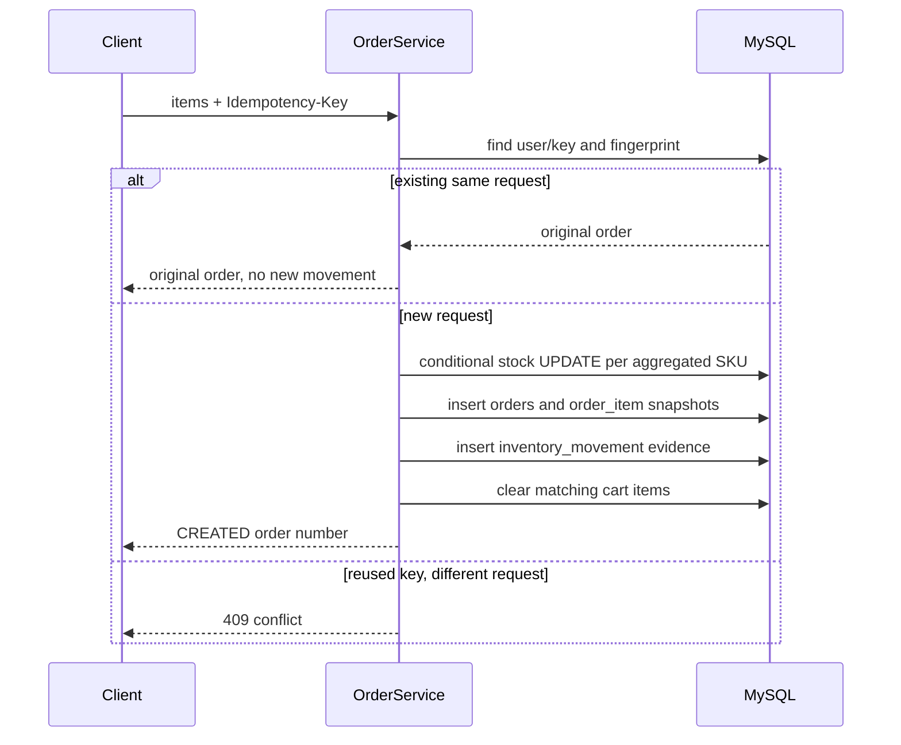

# Order Transaction Flow

The conditional `UPDATE inventory ... WHERE available_stock >= quantity` returns zero affected rows for insufficient/concurrently changed stock, preventing a negative value. The service is transactional: a failed deduction, insert, or later operation rolls back order, item, movement, and cart mutation. The stored uniqueness constraint protects order/SKU/`ORDER_DEDUCT` movement evidence; idempotent replays do not create duplicate effects.
