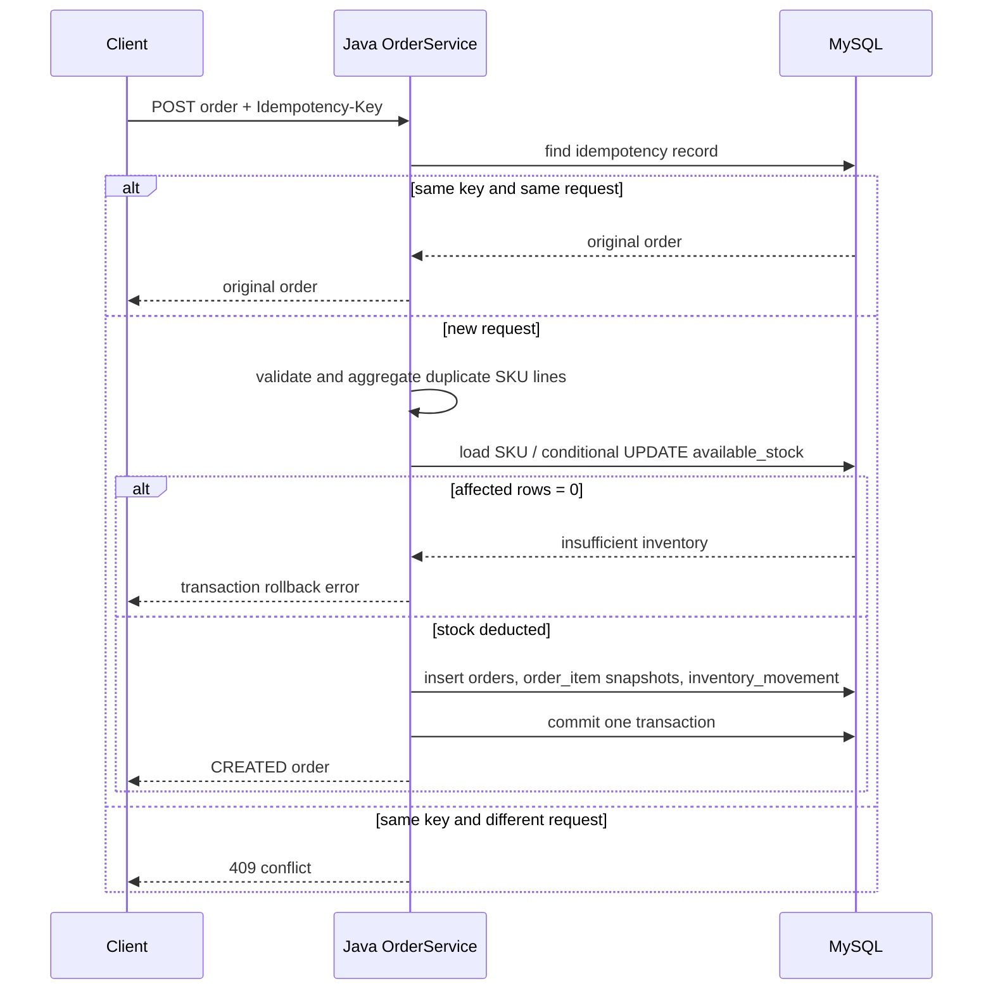

# Order Transaction Flow

1. Java requires `Idempotency-Key`, validates the request, and checks an existing order record.
2. It aggregates duplicate SKU lines before stock work.
3. For every SKU it performs `UPDATE inventory ... WHERE available_stock >= quantity`. Zero affected rows means the requested stock is no longer available; no negative stock is written.
4. In the same `@Transactional` JDBC write path it inserts `orders`, `order_item` business snapshots and `inventory_movement` audit rows, then clears matching cart lines.
5. Any stock failure or database exception rolls the transaction back, so no order, movement or partial stock deduction remains.
6. A successful repeat with the same key and fingerprint returns the original order and does not deduct or write evidence again. A reused key with a different request is `409` and writes nothing.

MySQL is the fact source for this flow. Redis has no order, inventory, idempotency, or MySQL transaction role. MyBatis is not used for these writes; it reads evidence and overview aggregates only.
