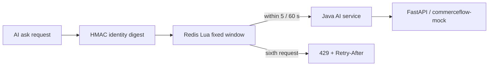

# Redis AI Rate Limit Flow

Only `POST /api/ai/customer-service/ask` uses Redis.

- The Lua script performs the fixed-window count atomically. The default is five requests per sixty seconds.
- Identity is a local HMAC digest of demo user and remote address; it is not production authentication and is not logged.
- A denied request returns 429 plus `Retry-After`, `X-RateLimit-Mode`, `X-RateLimit-Limit`, `X-RateLimit-Remaining`, and `X-RateLimit-Reset`.
- 429 does not call the Provider and does not create an `ai_trace` record.
- If Redis is unavailable, the current local Mock policy is `FAIL_OPEN`; the frontend displays the degraded mode rather than inventing quota numbers.
- Redis binds to loopback in local Compose. Aggregate health and readiness are reported separately by the Showcase runtime.
- Redis never participates in orders, inventory, carts, idempotency, or MySQL transactions. This is not a DDoS protection claim.
