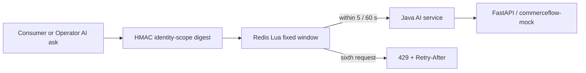

# Redis AI Rate Limit Flow

The versioned consumer and Operator customer-service endpoints use Redis:
`POST /api/v1/me/ai/customer-service/ask` and
`POST /api/v1/operator/ai/customer-service/ask`. The old
`POST /api/ai/customer-service/ask` is compatibility-only and remains behind
the local/demo legacy policy.

- The Lua script performs the fixed-window count atomically. The default is five requests per sixty seconds.
- Identity is a local HMAC digest of the server-derived consumer or Operator scope and remote address; it is not production authentication and is not logged.
- A denied request returns 429 plus `Retry-After`, `X-RateLimit-Mode`, `X-RateLimit-Limit`, `X-RateLimit-Remaining`, and `X-RateLimit-Reset`.
- 429 does not call the Provider and does not create an `ai_trace` record.
- If Redis is unavailable, the current local Mock policy is `FAIL_OPEN`; the frontend displays the degraded mode rather than inventing quota numbers.
- Staging/production profiles configure the AI rate-limit failure policy as `FAIL_CLOSED`; local/test behavior must not be used as a production availability or abuse-control claim.
- Redis binds to loopback in local Compose. Aggregate health and readiness are reported separately by the Showcase runtime.
- Redis never participates in orders, inventory, carts, idempotency, or MySQL transactions. This is not a DDoS protection claim.
