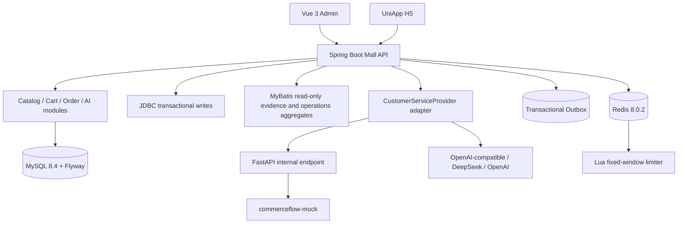

# System Architecture

CommerceFlow 是一个 Java 17 + Spring Boot 3 模块化单体，使用 MySQL 作为商品、订单、库存和幂等事实来源。

## Ownership and boundaries

- Java owns `businessFacts`, Evidence, Trace persistence, orders, inventory, idempotency and fallback.
- The Provider adapter receives constrained facts and returns a structured suggestion. FastAPI has no business database access and never calls Java back; external Provider keys stay server-side.
- MyBatis is limited to evidence and operations read aggregation. JDBC remains the order/inventory write path.
- Redis only limits the AI endpoint. It is not a cart, order, inventory, session, cache, or transaction authority.
- Outbox rows are written with the order transaction; no worker or external consumer is claimed until the staging phase adds one.
- The running mobile evidence is H5. Other UniApp targets are compilation evidence only.
