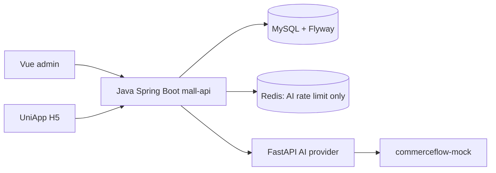

# System Architecture

CommerceFlow AI Mall is a local Showcase built as a Java modular monolith plus a narrow Python provider service. It is not a microservice platform.

- Java owns product, SKU, inventory, cart, order, Evidence, Trace, and all database writes.
- Python receives a restricted `businessFacts` payload and returns a structured suggestion. It does not access MySQL, mutate commerce state, or call Java back.
- Vue admin is a read-focused Showcase console. UniApp is accepted through local H5; other platforms are compile-only.
- MySQL contains Showcase seed data and transaction records. Redis is not involved in order/inventory consistency.
- No Kafka, Elasticsearch, vector database, payment provider, logistics provider, or public deployment exists.
