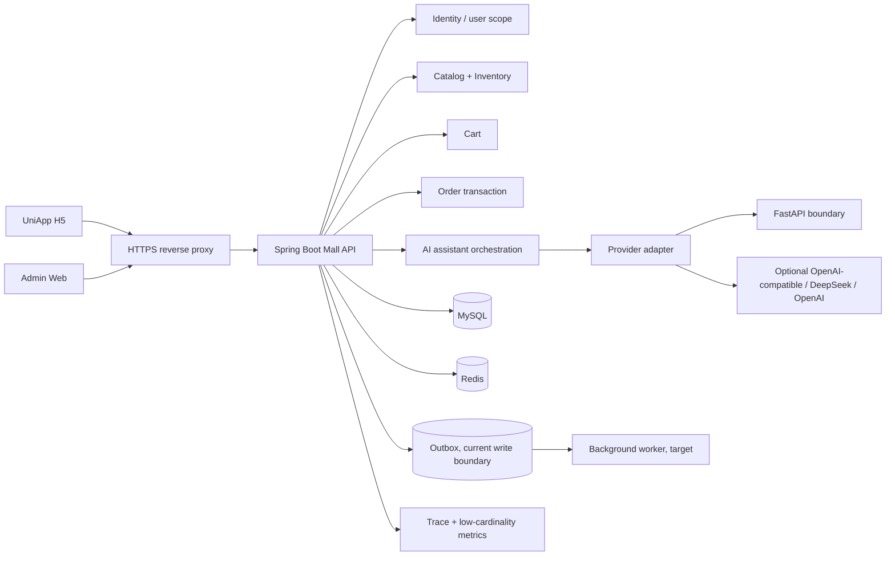

# CommerceFlow AI Mall 后端下一阶段设计

> 状态：E0 展示版契约冻结、E1 Showcase 用户作用域、E2 订单可靠性基础、E3 Provider/指标基础和 E4 staging 部署资产已实现；真实认证、备份恢复、真实 Provider 运行、Outbox 消费和公网发布仍待独立验收。日期：2026-09-03。本文以当前仓库源码和本地 Showcase 验收结果为基线，描述从“可复现本地展示”走向“可控的测试环境 / 预发布环境”的后端路线。文中出现的生产认证、支付、真实 Provider 运行质量、公共域名、监控告警和扩容均不能在当前简历中写成已完成能力。

## 0. 先说清楚：当前完成项与重构目标

### 当前已经完成

- 当前 Java 后端已经能支撑商品、SKU、库存、购物车、订单、AI 客服和运营读模型的本地闭环。
- 订单事务、CNY 金额、库存条件扣减、幂等键、订单明细快照、库存变动证据和 Redis 限流已有代码与测试覆盖。
- AI 客服已经有 Java 事实构造、受限 FastAPI 边界、本地 Mock/fallback 和 Trace 语义；Admin/H5 的本地真实 API 链路已经验收。
- E0 已集中现有 `/api/...` 路径、CNY 金额合同、`CREATED` 订单状态和关键 AI 响应 shape，并由 Java 反射契约测试保护；当前 Java 回归为 55 条测试通过。
- E1 已新增 `/api/v1/me/...` 版本化用户作用域链路；Phase 0-B 又新增 `/api/v1/operator/...` 管理边界。消费者通过 `CurrentUserPort` 获取服务端用户，管理端通过独立 `OperatorScope` 授权，不再从新接口的 query/body 读取 `userId`。当前实现只接入显式本地 Demo/test 适配器；最终 Java 回归数量见 Phase 0-B evidence。
- E2 已将订单编排改为依赖 `OrderWritePort`、`IdempotencyStore`、`InventoryPort` 和 `OutboxEventPort`；订单先取得持久化幂等记录，再扣库存，并在同一事务追加 `PENDING ORDER_CREATED` 事件；当前 Java 回归为 65 条测试通过。
- E3 已将 AI 调用收口为 `CustomerServiceProvider` 出站端口，保留 FastAPI 默认适配器并新增 OpenAI-compatible 适配器；配置支持 OpenAI/DeepSeek 兼容地址、模型、超时和有界重试，错误分类与低基数 Micrometer 指标已用本地 fixture 验证。
- 这些能力是当前项目已有基线，不等于已经完成生产认证、真实模型、支付、消息队列或公网部署。

### 尚未完成

- GitHub 案例中的完整生产化能力、真实身份/RBAC、Outbox 消费 Worker、真实 Provider 运行验收和公网发布，当前还没有全部落地；E0-E4 已完成契约保护、Demo 作用域隔离、订单 Outbox 写入基础、Provider 适配边界、本地可观测性和 staging 部署资产，本文件保留 staging 实跑及后续生产化路线。
- 因此，“后端测试已经通过”只能说明当前实现回归通过，不能表述为“后端重构和生产化已经完成”。

## 1. 设计目标

### 1.0 执行编号 E0-E4

为便于代码任务和求职交付跟踪，本项目将本设计中的后端路线映射为以下五个独立阶段：

| 执行阶段 | 对应设计范围 | 目标 |
| --- | --- | --- |
| E0 | B0 契约冻结 | 冻结现有 `/api`、事实字段、订单/CNY/AI 响应合同；已完成 |
| E1 | B1 用户作用域 | `/api/v1/me/...` 和服务器派生 Demo 用户作用域；已完成；真实身份/RBAC 未实现 |
| E2 | B2 订单可靠性 | 订单/库存/幂等端口、幂等先占、事务 Outbox 写入；已完成基础；消费 Worker 未实现 |
| E3 | B3+B4 Provider 与可观测性 | Provider SPI、安全适配、错误分类、日志/指标脱敏；已完成本地协议基础 |
| E4 | B5 staging | Docker、迁移、反向代理、环境校验和健康检查资产已完成；备份恢复、回滚演练和公网发布待实跑 |

E0-E4 的代码资产完成不代表公网运行自动完成；每个阶段都必须有对应代码、测试和运行证据。E1 的“已完成”只指版本化 Controller 和可替换用户端口的 Showcase 边界，不指生产认证。E2 的“已完成”只指订单端口和同库 Outbox 写入，不指外部事件已经发布或消费。E3 的“已完成”只指适配器、错误边界和本地指标已验证，不指真实供应商调用、余额、模型质量或公网稳定性。E4 的“已完成”只指 staging Docker/反向代理/环境校验资产已准备并通过静态配置检查，不指镜像已经成功构建、服务器已经启动或域名已经发布。

CommerceFlow 当前最有价值的闭环不是“做一个看起来像电商的页面”，而是把商品事实、库存一致性、订单写入、AI 事实回答和证据链放在同一个可验证系统里。下一阶段后端继续围绕这条主线收口：

1. 先把演示用户和 query 参数身份替换为可审计的用户上下文。
2. 保持订单库存事务和幂等语义，在增加能力时不破坏现有证据。
3. 把 AI Provider 从“本地 Mock + Java fallback”扩展为可替换、可超时、可观测、不会泄露业务数据的 Provider 适配层。
4. 将本地配置、数据库迁移、限流、日志和健康检查整理成可重复的 staging 部署单元。
5. 仍然不把支付、物流、退款、商业运营指标或高并发能力伪装成已经存在。

### 1.1 非目标

- 本阶段不直接实现支付网关、微信/支付宝结算、物流、优惠券、营销推荐或商家结算。
- 不从前端页面臆造地址、订单付款状态或用户画像表。
- 不让浏览器直接持有 AI Provider Key，也不让 FastAPI 直接访问 MySQL。
- 不为了“看起来更生产”引入没有测试和回滚方案的微服务拆分。

## 2. 当前事实基线

### 2.1 当前已经存在

| 领域 | 当前实现 | 当前接口 / 证据 |
| --- | --- | --- |
| 商品 | Product、Category、SKU、商品状态、商品图片路径 | `GET /api/products`、`GET /api/products/{id}` |
| 库存 | 每个 SKU 一条库存记录；下单时条件扣减 | `inventory.available_stock`、Java 事务测试 |
| 购物车 | 以演示用户和 SKU 唯一约束保存数量 | `GET/POST/PUT/DELETE /api/cart...` |
| 订单 | CNY、订单明细快照、库存变动证据、`Idempotency-Key` | `POST/GET /api/orders...` |
| AI 客服 | Java 构造 `businessFacts`，调用本地 FastAPI Mock，失败时 Java fact fallback | `POST /api/ai/customer-service/ask` |
| 限流 | Redis Lua 固定窗口，默认 5 次 / 60 秒；Showcase 可 FAIL_OPEN | AI 响应头与 `429` smoke |
| 运营读模型 | 商品、库存、订单、Trace、运行边界聚合 | `GET /api/operations/overview` |
| 前端 | Admin + UniApp H5 已做多视口和真实本地链路验收 | `docs/evidence/frontend-redesign/README.md` |

### 2.2 必须承认的缺口

- Demo `userId=1`、Demo Operator `9001` 和 `demo-login` 都不是生产认证；购物车、订单和 AI 请求仍然需要真正的消费者/管理身份作用域。
- 订单状态当前只有 `CREATED`，没有支付、取消、退款或发货事实。
- AI 当前默认 `commerceflow-mock / MOCK`；E3 已提供可配置的 OpenAI-compatible 适配器，但没有真实密钥和供应商运行证据，不能证明模型质量、成本或 SLA。
- AI Provider 配置和 Redis 限流属于服务配置，当前没有 secret manager、密钥轮换、租户配额或生产告警。
- 当前是模块化单体，不需要先拆成多个远程服务；MySQL 和 Redis 是本地 Showcase 依赖。

### 2.3 GitHub 案例研究与本项目取舍

本次通过 GitHub/`gh` 调研了以下公开仓库。它们只用于提炼结构和工程方法，不复制第三方源码、品牌、截图或业务数据。

| GitHub 案例 | 可迁移做法 | 在 CommerceFlow 的取舍 |
| --- | --- | --- |
| [spring-projects/spring-modulith](https://github.com/spring-projects/spring-modulith) | 用业务直系包表达模块；用 `ApplicationModules.verify()` 做边界校验；为模块写隔离集成测试；自动生成模块文档 | 先在一个 Spring Boot 进程内落地 `catalog`、`inventory`、`cart`、`order`、`ai`、`operations`，不先拆远程服务 |
| [xsreality/spring-modulith-with-ddd](https://github.com/xsreality/spring-modulith-with-ddd) | 从 DDD 领域模型逐步演进到 Modulith、六边形架构和安全边界；模块之间通过公开端口或事件协作 | 订单只依赖 Catalog/Inventory 的公开端口；Provider、支付和通知均通过端口隔离，避免 Controller 直接串数据库 |
| [sivaprasadreddy/spring-modular-monolith](https://github.com/sivaprasadreddy/spring-modular-monolith) | 电商按 Common、Catalog、Orders、Inventory、Notifications 分模块；订单事件驱动库存和通知；模块数据边界清晰 | 采用其业务分区思路，但首期只保留 Java 模块化单体；通知使用事务 Outbox 作为目标，不为了展示引入 RabbitMQ/Kafka |
| [spring-petclinic/spring-petclinic-modulith](https://github.com/spring-petclinic/spring-petclinic-modulith) | public API 与 internal 包分离；跨模块使用应用事件；模块测试、事件发布登记和模块文档形成验收闭环 | 为每个业务模块定义可导出的 facade/event；内部 Repository、Entity 不跨模块暴露；增加模块结构测试 |
| [lombocska/spring-boot-outbox-transactional-sample](https://github.com/lombocska/spring-boot-outbox-transactional-sample) | 业务写入和待发布事件在同一数据库事务中提交；消费者按至少一次语义处理并确认/重试 | 订单成功后写入 `outbox_event`，消费者用 event id 去重；先使用可观测的本地 worker，消息 broker 作为后续扩展 |

最终选择是“模块化单体 + 领域端口 + 事务 Outbox + 可替换 Provider”。这比把当前项目直接复制成微服务更适合现有规模，也能在面试中展示边界、事务、幂等和可测试性。

### 2.4 对当前代码的具体重构映射

| 当前位置/能力 | 下一阶段重构动作 | 验收证据 |
| --- | --- | --- |
| `apps/mall-api` 中的商品、库存、购物车、订单代码 | 按业务模块整理 package 和公开 facade；禁止跨模块直接依赖 Repository/Entity | `ApplicationModules.verify()`、模块依赖图、模块测试 |
| 订单服务的库存扣减和幂等逻辑 | 保留现有事务语义，抽出 `OrderCommand`、`InventoryPort`、`IdempotencyStore` | 并发扣库存、同 Key 重放/冲突、失败回滚测试 |
| `CustomerServiceProviderClient` / FastAPI 调用 | 已收口为 `CustomerServiceProvider` port；FastAPI 和 OpenAI-compatible/DeepSeek 复用配置化 adapter | Provider 401/429/5xx、超时、坏 JSON、fallback 与低基数指标测试 |
| 当前运营读模型 | 只读聚合通过 query service 获取，不能反向写订单事实 | API 契约测试和数据权限测试 |
| 订单完成后的通知/索引等副作用 | 新增 `outbox_event`，与订单主事务同库提交，worker 幂等消费 | 断电/重试/重复消费场景测试 |

## 3. 目标架构



目标仍是一个 Java 模块化单体。AI Provider、异步 outbox worker 和外部支付（未来）是边界，不等于现在就要将每个目录拆成独立部署服务。

建议模块职责：

| 模块 | 责任 | 不能越界 |
| --- | --- | --- |
| `account` | 登录、用户状态、角色和当前用户作用域 | 不在 Controller 中信任任意 `userId` |
| `catalog` | 商品、分类、SKU 和只读目录 | 不负责订单扣库存 |
| `inventory` | 库存读取、条件扣减、库存变动 | 不直接暴露数据库写接口给前端 |
| `cart` | 当前用户购物车 | 不决定支付或订单最终状态 |
| `order` | 订单事务、幂等、快照和证据 | 不在重试中重复扣库存 |
| `ai` | 业务事实、Provider 路由、结构化输出、Trace | 不把前端文本直接拼成 Provider system prompt |
| `operations` | 只读聚合、运行边界和诊断 | 不把本地样本计算成商业 KPI |
| `outbox` | 事务提交后的异步通知/任务边界 | 不代替订单主事务 |

## 4. 接口演进设计

### 4.1 版本和兼容策略

当前 `/api/...` 是 Showcase 兼容契约；Phase 0-B 已将消费者迁移到 `/api/v1/me/...`、管理端迁移到 `/api/v1/operator/...`，旧路径只在显式 LOCAL/DEMO 迁移期保留。不要把旧 query/body `userId` 语义当成生产权限。

```text
现有 /api/products                 -> 保持兼容，逐步增加分页参数
目标 /api/v1/catalog/products      -> 认证无关的公开目录读接口
现有 /api/orders?userId=1          -> 过渡兼容，仅本地模式允许
目标 /api/v1/me/orders             -> 从认证主体派生 userId
现有 /api/ai/customer-service/ask -> 保持结构化响应和 Evidence/Trace
目标 /api/v1/ai/customer-service/ask -> 只接受当前用户可访问的 SKU
```

### 4.2 身份和用户作用域

目标请求不再由客户端传任意 `userId`。E1 已在 Demo 模式先落地同一依赖方向；真实请求在接入身份平台后再启用：

```http
GET /api/v1/me/cart
POST /api/v1/me/cart/items
POST /api/v1/me/orders
POST /api/v1/me/ai/customer-service/ask
Authorization: Bearer <access-token>
Idempotency-Key: <client-generated-key>
```

服务器从认证主体得到 `userId`，对商品、SKU、购物车和订单做归属检查。当前 E1 的 `ShowcaseCurrentUserAdapter` 仅在显式 LOCAL/DEMO + `SHOWCASE_AUTHENTICATION_MODE=DEMO_USER` 下返回 `SHOWCASE_DEMO`；非 Demo/无身份模式返回 `401 UNAUTHENTICATED`。管理端另需显式 Operator scope。兼容旧接口时必须加上模式和开关门槛，任何 staging/production profile 都不得默认接受 `userId=1`。

### 4.3 订单接口

目标首期仍只承诺“创建订单”，不添加虚假的已支付状态：

```json
POST /api/v1/me/orders
{
  "items": [
    { "skuId": 10001, "quantity": 1 }
  ]
}
```

响应继续返回 `orderNo`、CNY 金额、`CREATED` 状态和明细快照。必须保留：

- `Idempotency-Key` 必填、长度受限、按用户唯一；
- 同 Key 同请求返回原订单；同 Key 不同请求返回明确的 `409 IDEMPOTENCY_KEY_REUSED`；
- 同一事务内完成 SKU 校验、库存条件扣减、订单、明细快照、库存变动和购物车清理；
- 失败时任何库存、订单或证据写入都回滚。

支付接入后另行设计 `payment_attempt` 和订单状态机；在没有真实支付回调前，不增加 `PAID`、`SHIPPED`、`REFUNDED` 等状态。

## 5. 数据和一致性设计

### 5.1 保留现有表的事实字段

`product`、`product_sku`、`inventory`、`cart_item`、`orders`、`order_item`、`inventory_change_log`、`ai_trace` 是当前事实基线。历史订单必须继续使用商品名、SKU 编码、规格、单价和图片路径快照，不能由当前商品表回填。

### 5.2 下一阶段候选表

只在对应功能开始实现时迁移，不提前创建空表来制造“已支持”的错觉：

| 表 | 用途 | 必要约束 |
| --- | --- | --- |
| `user_role` / `user_session` | 用户角色和会话撤销 | 用户状态、过期时间、索引；密码只存强哈希 |
| `address` | 收货地址（真正需要物流前） | 用户归属、默认地址唯一、脱敏日志 |
| `outbox_event` | 订单提交后异步通知或索引任务 | 与主事务同库提交，消费幂等 |
| `payment_attempt` | 未来支付尝试 | 外部交易号唯一，回调幂等，不由前端改状态 |
| `ai_request_policy` | Provider / 租户 / 用户配额 | 不能存 API Key 明文；策略变更需审计 |
| `ai_trace` 扩展 | correlation、token/费用摘要、错误分类 | 不存完整 Authorization、密钥或原始敏感请求 |

### 5.3 并发和重试

- 库存扣减继续使用条件更新或明确的行锁策略，并在集成测试中覆盖两个并发请求只有一个成功的边界。
- 订单创建的重试由幂等键保护；网络超时不能直接假定失败，应先查询幂等记录或订单结果。
- Provider 重试只允许有限次、只针对可重试错误，并为每次尝试写入安全摘要；不重试 4xx 业务错误和结构化校验失败。
- Outbox 消费必须使用事件 ID 去重；消费者失败进入可查看的 retry/dead-letter 状态，不回写主订单为虚假成功。

## 6. AI Provider 设计

### 6.1 适配层

当前 Java 通过 `CustomerServiceProvider` 调用选定适配器。E3 保留 FastAPI 边界，并增加统一兼容协议实现：

```text
CustomerServiceProvider
  ├─ FastApiProvider                # 当前受限 Python 服务 / commerceflow-mock
  └─ OpenAiCompatibleProvider       # 统一 chat-completions 协议
       ├─ OpenAI
       └─ DeepSeek / compatible gateway
```

OpenAI 和 DeepSeek 的 Java 适配边界已实现；是否真正可用仍由临时环境变量、模型权限、网络、余额和供应商响应共同决定，不能因为配置项存在就写成已上线或模型质量已验收。

### 6.2 请求和响应安全

Java 只发送当前问题所需的最小业务事实：商品、SKU、价格、币种、状态、库存和允许展示的证据。禁止发送：

- Provider API Key、Authorization header、数据库连接信息；
- 未脱敏用户信息、内部账号、完整错误日志和不必要的订单历史；
- 未经校验的前端指令作为 system prompt。

Provider 返回后必须依次执行：HTTP 状态校验 → JSON 解析 → 字段长度/枚举校验 → 业务事实一致性校验 → Evidence/Trace 保存。无法证明的回答进入安全 fallback 或拒答；前端不能直接调用 Provider。

### 6.3 配置契约

建议 staging/production 只通过环境变量或 secret manager 注入：

```text
COMMERCEFLOW_AI_PROVIDER=FASTAPI|OPENAI_COMPATIBLE|OPENAI|DEEPSEEK
COMMERCEFLOW_AI_BASE_URL=https://...
COMMERCEFLOW_AI_MODEL=...
COMMERCEFLOW_AI_API_KEY=<secret-manager-reference>
COMMERCEFLOW_AI_CONNECT_TIMEOUT_MS=1500
COMMERCEFLOW_AI_READ_TIMEOUT_MS=8000
COMMERCEFLOW_AI_MAX_RETRIES=1
COMMERCEFLOW_AI_FALLBACK_ENABLED=true
```

日志/指标只打印或记录 provider mode、model、request correlation、耗时、状态和错误分类；当前指标只使用固定 `mode/outcome` 标签，不打印 Key、完整 prompt、完整响应或业务秘密。外部 Provider 的限流和余额耗尽都映射为安全错误/降级，并在运营页显示 `MOCK` 或 `REAL_OPENAI_COMPATIBLE` 运行边界。

## 7. 认证、权限和安全边界

目标最小角色：

| 角色 | 可读 | 可写 |
| --- | --- | --- |
| `CUSTOMER` | 自己的目录、购物车、订单、AI 问答 | 自己的购物车、创建订单、自己的 AI 请求 |
| `OPERATOR` | 商品、库存、订单执行证据、AI Trace | 受控的目录/库存运营动作，需另行审计 |
| `ADMIN` | 全部运营读模型与审计 | 用户、策略和系统配置 |
| `AUDITOR` | 只读 Trace、订单证据和安全日志摘要 | 无业务写权限 |

落地顺序：

1. 统一登录入口和当前用户上下文；密码使用强哈希，或接入已有身份平台。
2. 为每个 Controller 的资源查询增加用户/角色作用域；禁止仅依赖前端隐藏按钮。
3. CORS 只允许明确的 Admin/H5 origin；公网入口强制 HTTPS；错误响应不泄露 SQL、堆栈或 Provider 原文。
4. Redis 限流按用户主体 + IP + 接口分层；外部 AI 失败策略默认 fail-closed 或明确降级，不沿用 Showcase 的默认信任边界。
5. 增加密钥轮换、审计、依赖漏洞扫描和备份恢复演练。

## 8. 可部署环境设计

建议逻辑拓扑如下，域名只是待配置的候选，不代表当前已经解析：

```text
mall.wzl8.top       -> H5 static assets / CDN
mall-admin.wzl8.top -> Admin static assets
mall-api.wzl8.top   -> HTTPS reverse proxy -> Spring Boot
```

如果继续使用一个域名，也可以通过路径区分，但 API、Admin 和 H5 的 CORS、缓存和发布回滚会更难管理。部署单元建议：

- `mall-api`：Java 镜像，非 root 用户，健康检查和优雅停机；
- `ai-service`：仅内网可访问，限制出站地址和请求体大小；
- MySQL：持久卷、备份、迁移锁和只读备份验证；
- Redis：持久化策略按限流需求选择，密码/网络 ACL，不承担订单事实；
- reverse proxy：TLS、压缩、请求体/超时限制、基础安全 header；
- Admin/H5：构建产物与 API base URL 在环境层注入，不把本地 `127.0.0.1` 带入生产。

首次公网发布之前必须有 staging 环境，先完成迁移、健康检查、备份恢复、限流、错误页、日志脱敏和回滚演练。当前没有执行 DNS、域名解析、云资源创建或部署。

## 9. 分阶段实施和退出条件

| 阶段 | 工作内容 | 退出条件 |
| --- | --- | --- |
| B0 契约冻结 | 固化 `/api/v1` DTO、身份来源、订单状态和 AI 响应 | API 文档、契约测试、旧 Showcase 不回归；E0 已完成 |
| B1 用户作用域 | 登录/会话/角色、`/me` 资源路径、CORS | `/me` Demo 端口和无 `userId` 路由已完成；真实认证/RBAC 待实现 |
| B2 订单可靠性 | 并发扣库存、幂等恢复、事务和 outbox 基础 | 幂等先占、端口结构、Outbox 同事务写入和回归已完成；Worker/消费待实现 |
| B3 Provider 适配 | Mock/FastAPI/OpenAI-compatible/DeepSeek 配置化适配 | Key 不入仓、超时/429/坏 JSON/拒答均有测试；E3 本地协议基础已完成 |
| B4 可观测性 | correlation、结构化日志、指标、告警和脱敏 | E3 已有固定 `mode/outcome` 指标；结构化日志、告警和公网观测待 staging |
| B5 staging | Docker/迁移/备份/反向代理/前端环境配置 | staging smoke、回滚和恢复演练通过 |
| B6 受控发布 | 先内部访问，再公开链接；记录版本、迁移和回滚点 | 发布审批、监控窗口和回滚方案齐备 |

支付/物流只有在产品需求和供应商回调契约明确后，另立 B7 设计和迁移，不作为本阶段默认工作。

## 10. 测试门槛

- 单元：金额精度、CNY 校验、幂等指纹、库存边界、Provider 错误映射、限流窗口。
- 集成：MySQL Flyway、Redis Lua、订单事务、并发扣库存、同 Key 重放/冲突、outbox 去重。
- API 契约：认证、CORS、错误结构、分页、越权和 Provider 结构化响应。
- AI 安全：prompt injection 作为业务字段输入、恶意 Citation、超长响应、空响应、供应商 401/403/429/5xx、超时和 fallback。
- 浏览器：H5/Admin 真实 API 链路、多视口、破图、横向溢出、空态/错误态；外部 Provider 只在明确配置的 staging 隔离环境验证。
- 运维：镜像启动、迁移回滚策略、健康/就绪、备份恢复、日志中不存在 Key 和敏感请求。

## 11. 完成定义和简历口径

只有 B0～B5 具备可复现证据后，才可以把项目描述为“带认证、Provider 适配和 staging 运行边界的电商 AI 客服系统”。在此之前应继续使用：

> Java 模块化单体 + MySQL/Flyway/Redis，完成商品事实、库存事务、订单幂等和可追溯 AI 商品客服 Showcase；Provider 默认是本地确定性 Mock，并已具备 OpenAI-compatible 适配边界，真实模型验收、公网部署与生产认证待后续实现。

当前文档本身已经完成；文档中的目标模块、配置、表和域名没有因为写入而自动获得实现状态。
